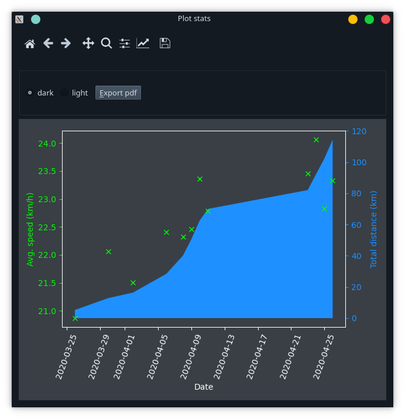

# MyCycle

Edit and plot my cycling stats.

MyCycle provides a better interface for inputting
csv data than a spreadsheet or a plain text editor.

It will also plot my average speed (km/hour) and
total distance cycled in a Matplotlib figure, which 
can be exported as a pdf.

Most of the GUI for handling the csv data is from 
[TimeAfterTime](https://github.com/keziah55/TimeAfterTime),
with a few tweaks and an expansion of the `Data` class into
a larger structure with `__getitem__` and `__setitem__` 
methods.

## Branch summary

Master is currently up to date :)
